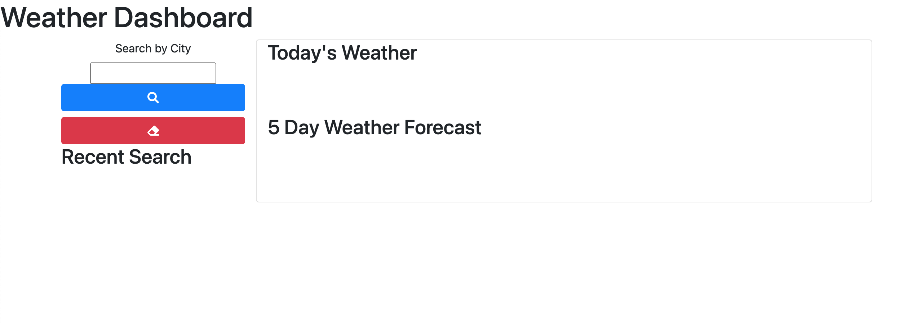

# Weather Dashboard
## **Description**  
-------------
Weather Dashboard is an application to check the weather in a city. The application was built using the third-party API- _OpenWeather_.
The application makes requests to this API and is able to show the current weather and a 5 day forecast. 

 ## **How to Use**
 ---------------
- The user would start at the homepage where they are able to enter the city they want to look the weather up for. There the _Current Weather Section_ will show the weather at that moment. 
-This would also produce a five day forecast for the weather. 

-A user would have their recent searches saved under the search button. There they are able to easily access past searches.  

  -At the bottom, the user will find the graph with their history of transaction by date. 

## **Built With**
---------------
- 
- 
- 
- 
- 
- 

## **Contributors**
--------------------
  

- Rudy S. [GitHub](https://github.com/Rudys212)

## **License**
--------------------
MIT License

Copyright (c) 2021 Rudys212

Permission is hereby granted, free of charge, to any person obtaining a copy
of this software and associated documentation files (the "Software"), to deal
in the Software without restriction, including without limitation the rights
to use, copy, modify, merge, publish, distribute, sublicense, and/or sell
copies of the Software, and to permit persons to whom the Software is
furnished to do so, subject to the following conditions:

The above copyright notice and this permission notice shall be included in all
copies or substantial portions of the Software.

THE SOFTWARE IS PROVIDED "AS IS", WITHOUT WARRANTY OF ANY KIND, EXPRESS OR
IMPLIED, INCLUDING BUT NOT LIMITED TO THE WARRANTIES OF MERCHANTABILITY,
FITNESS FOR A PARTICULAR PURPOSE AND NONINFRINGEMENT. IN NO EVENT SHALL THE
AUTHORS OR COPYRIGHT HOLDERS BE LIABLE FOR ANY CLAIM, DAMAGES OR OTHER
LIABILITY, WHETHER IN AN ACTION OF CONTRACT, TORT OR OTHERWISE, ARISING FROM,
OUT OF OR IN CONNECTION WITH THE SOFTWARE OR THE USE OR OTHER DEALINGS IN THE
SOFTWARE.

## **Links** 
---------------
- [GitHub Repo](https://github.com/Rudys212/Homework-06-Weather-Dashboard)

- [Deployed app in GitHub](https://rudys212.github.io/Homework-06-Weather-Dashboard/)